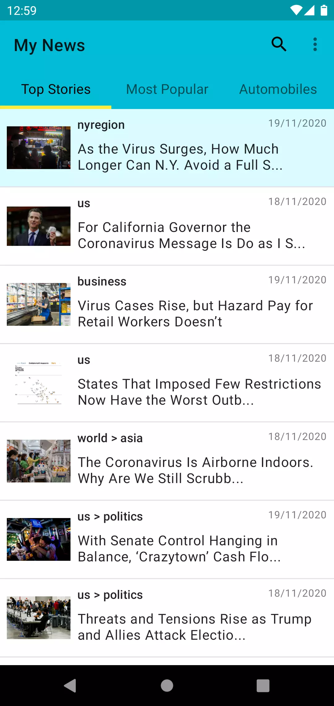
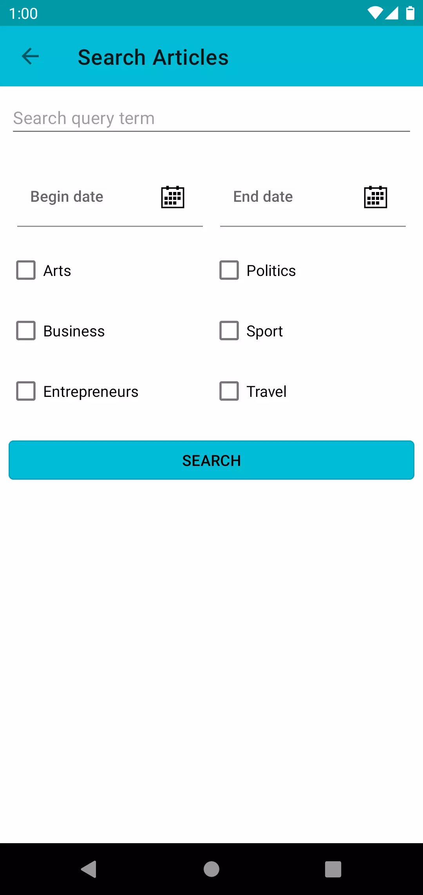
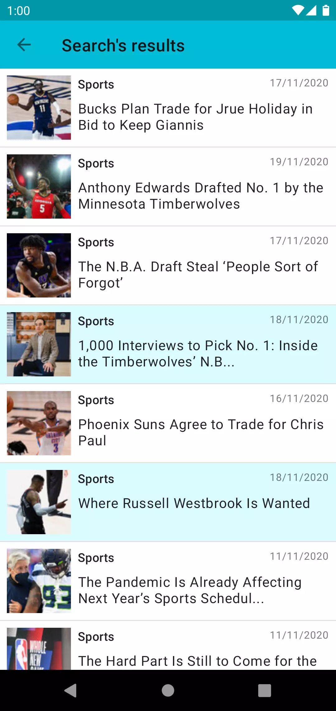
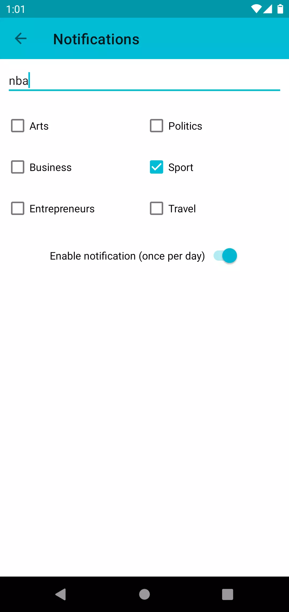

# My News

An Android app that use the NewYork Times API to fetch news.

## Description

This app allowed me to learn many things about the Android development.  

Training to use :

    - Java
    - Oriented object programming
    - Butterknife
    - Usage of various API
    - Retrofit
    - RxJava 2
    - Unit tests (Mockito) & Ui tests (Espresso & Barista)
    - Android UI (ViewPager, Recycler View, TabLayout, WebView)

## Features

    - See all fetched news from the New York Times
    - Search news by criterias
    - See the news already read
    - Receive a notification when a new article is published
    - Swipe to refresh
    - Slide to pass to another screen or use TabLayout

## Run on

You can run the app directly after downloading or clone the repository.  
The New York Times API has a limit of 4000 requests per day and 10 requests per minute. If you want to use your own api key to control this limit, login or create an account in <https://developer.nytimes.com/> and generate an apikey.
Replace the given api key in the String named api_key:  

    - mynews/utils/NYTimesServiceAPI/
      - String api_key = "xxxxxxxxxxxxxxxxxxxxxx";

## Documentation

You can find a fully french documentation here :
<a href="assets/documentation/doc_mynews.pdf">Documentation</a>

## ScreenShot

Home page

Search Screen

Search result screen

Notification's settings screen

